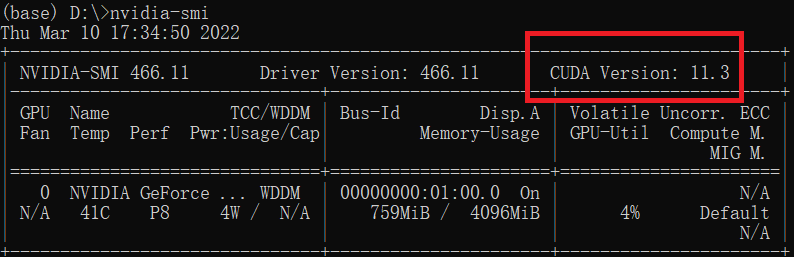
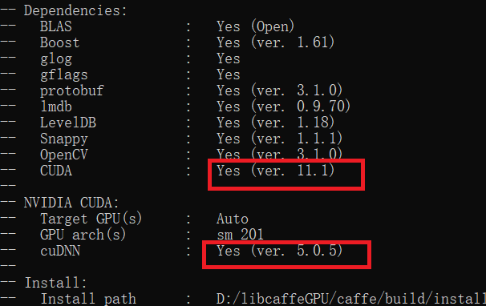

### The installation caffe-gpu version 
+ CUDA 7.5 or 8.0 (use CUDA 8 if using Visual Studio 2015)
+ cuDNN v5

### Prepare GPU environment
Firstly, open an Anaconda Prompt and check current cuda version by
```
(base)D:\libcaffe> nvidia-smi
```
<p align="center">
  
</p>
The result shows I've already had CUDA 11.3 installed on computer, which doesn't meet caffe's requirement. So we have to change it.

+ nvcc fatal   : Unsupported gpu architecture 'compute_201': CUDA 11.1 but cuDNN 5.0.5
  + Download cuDNN from [here](https://developer.nvidia.com/rdp/cudnn-archive)
  + Change the version of CUDA from 11.1 back to 8.0?
<p align="center">
  
</p>
