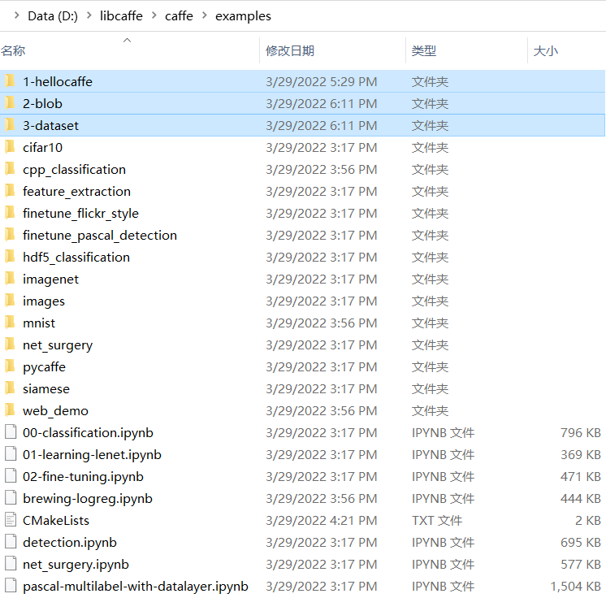

# Caffe
+ [0-installation and running the 1st example](https://github.com/suzyi/cpp/blob/master/caffe/0-caffe_installation.md)

Examples below are copied and modified from this repository [koosyong/caffestudy](https://github.com/koosyong/caffestudy/):
+ [1-hellocaffe](https://github.com/suzyi/cpp/tree/master/caffe/1-hellocaffe)

When compiling these examples, I suffered from error messages such as "glog.cmake" is missing. To alleviate this, an alternative way is putting these files and aranging them like below. Then rebuild the caffe project from scratch.

  

