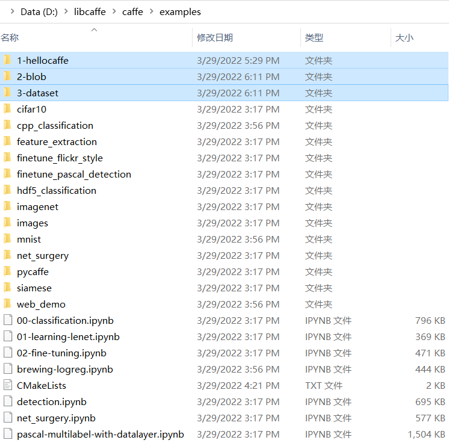

# Caffe
### 1 - Installation
+ [0-installation and running the 1st example](https://github.com/suzyi/cpp/blob/master/caffe/0-caffe_installation.md)

### 2 - Basic Examples
Examples below are copied and modified from this repository [koosyong/caffestudy](https://github.com/koosyong/caffestudy/):
+ [1-hellocaffe](https://github.com/suzyi/cpp/tree/master/caffe/1-hellocaffe)

When compiling these examples, I suffered from error messages such as "glog.cmake" is missing. To alleviate this, an alternative way is putting these files and aranging them like below. Then rebuild the caffe project from scratch.

  

### 3 - Further Examples
+ Classification
+ Segmentation

### 4 - Containers
+ `Blob<Dtype>* const blob = new Blob<Dtype>(20, 30, 40, 50);` Binary long object
  + `blob->asum_data()`-absolute sum
  + `blob->channels()`
  + `blob->count()`-`batchsize*channels*height*width`
  + `blob->cpu_data()`
  + `blob->gpu_data()`
  + `blob->height()`
  + `blob->mutable_cpu_data()`
  + `blob->num()`-batchsize
  + `blob->offset(100,0,0,0)`
  + `blob->Reshape(50, 40, 30, 20)`
  + `blob->sumsq_data()`
  + `blob->width()`
+ `caffe::InnerProductLayer< Dtype > Class Template Reference`
  + `LayerParameter layer_ip_param; InnerProductLayer<Dtype> layer_ip(layer_ip_param);`
### 5 - exe
+ `build\tools\Release\convert_imageset.exe data\re\ data\re\trainlist.txt data\re\img_train_lmdb`
+ `build\tools\Release\compute_image_mean.exe data\re\img_train_lmdb data\mean.binaryproto`
+ `build\tools\Release\caffe.exe train -solver=data\re\solver.prototxt`