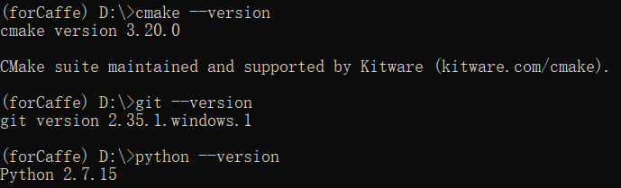

# caffe
This article contains
+ the installion of caffe on windows 10,
+ the classification task of MNIST using the installed caffe.

After installation, source files (.cpp, .h) will be converted to executable files, such as
+ caffe.exe
+ convert_mnist_data.exe

and so on.
## 1 - Installation
There are many posts online sharing the installation of Caffe on Windows 10. Among them, three posts are mostly mentioned, i.e., 
+ [BVLC-caffe-windows](https://github.com/BVLC/caffe/tree/windows/). This one is the official document teaching people to install caffe. So we will follow it to complete our installation.
+ [willyd-caffe-builder](https://github.com/willyd/caffe-builder). willyd is a major contributor maintaining BVLC-caffe-windows. He also posted willyd-caffe-builder to help people install caffe in a easy way.
+ [microsoft-caffe](https://github.com/microsoft/caffe). Maintained by Microsoft, this repository adds some extra features uppon BVLC-caffe.

We follow the steps of BVLC-caffe-windows to build and install Caffe.
### 1-1- Install Visual Studio 2013
+ Install Visual Studio 2013 (vs 2013). [A Chinese tutorial of downloading and installing vs2013](https://jingyan.baidu.com/article/3ea5148999921f52e61bbae0.html) is helpful.
  + In fact, only the VS C/C++ compiler is required (cl.exe). 
  + After vs2013 is installed, you can find the VS C/C++ compiler (cl.exe) in `D:\vs2013\VC\bin\amd64\cl.exe`.
  + Check if VS 2013 works fine by running a "hello world" project by following [this](https://github.com/suzyi/cpp/tree/master/cmake/examples/print_hello_world).
  + If errors `No CMAKE_C_COMPILER could be found. No CMAKE_CXX_COMPILER could be found`, or `-- The C compiler identification is unknown-- The CXX compiler identification is unknown` occurs, make a backup for files "D:\vs2013\VC\bin\rc.exe" and "D:\vs2013\VC\bin\rcdll.dll", repectively. Then try copying "C:\Program Files (x86)\Windows Kits\8.1\bin\x86\rc.exe(and rcdll.dll)" to "D:\vs2013\VC\bin\", to replace them. Hopefully, such errors may disappear.
### 1-2- Install cmake
+ download a suitable cmake version for your computer from [cmake official website](https://cmake.org/download/). A suitable version here is a binary distribution "Windows x64 Installer".
+ double click the installer after the downloading is complete and then fill in a path where you want cmake be installed and proceed to complete the installation.
+ test if the cmake is successfully installed by opening powershell or cmd and run `cmake -version`.
  + If error occurs when executing `cmake -version`, try adding the installation path of cmake to the environment path of computer.
### 1-3- Install Anaconda and required packages
[Download and Install the latest version of Anaconda](https://www.anaconda.com/?modal=nucleus).

After Anaconda is installed, open an Anaconda Propt to install python 2.7 by following steps:
```
# it outputs python 3.9
(base)> python --version

# create a virtual environment with python 2.7
(base)> conda create --name forCaffe python=2.7

# check all existed environments to see if forCaffe exists
(base)> conda info --envs

# activate
(base)> conda activate forCaffe
# now, it should give python 2.7
(forCaffe)> python --version

# install git
(forCaffe)> conda install -c anaconda git

# check if every thing goes well
(forCaffe)> cmake --version
(forCaffe)> git --version
(forCaffe)> python --version
```
Expected results are
<p align="center">
  
</p>

### 1-4- Install Caffe
With all requirements met, we now begin to install caffe.

Firstly, 
+ Create an empty folder, e.g., "D:\libcaffe\".
+ Open an Anaconda Prompt and download BVLC-Caffe project by these lines
  + `(base)D:\libcaffe> conda activate forCaffe`
  + `(forCaffe)D:\libcaffe> git clone https://github.com/BVLC/caffe.git`
  + `(forCaffe)D:\libcaffe> cd caffe`
  + `(forCaffe)D:\libcaffe>caffe> git checkout windows`. This line will create the file "D:\libcaffe\caffe\scripts\build_win.cmd"

Next, configure generator/CPU/python interface by editing the file "D:\libcaffe\caffe\scripts\build_win.cmd":
+ If you have CUDA installed but want a CPU-only version you can set `-DCPU_ONLY=1`.
+ `set WITH_NINJA=0` disables ninja generator.
+ `set MSVC_VERSION=12` specifies "Visual Stutio 12 2013 Win64" generator.
+ `set CPU_ONLY=1` disables GPU and enable CPU.
+ `set PYTHON_VERSION=2` specifies python 2.7
+ `set BUILD_PYTHON=0` and `set BUILD_PYTHON_LAYER=0` will not support python interface.

In addition, better download the file "libraries_v120_x64_py27_1.1.0.tar" from this [link](https://github.com/willyd/caffe-builder/releases) and place it to the path `C:\Users\jack\.caffe\dependencies\download\libraries_v120_x64_py27_1.1.0.tar`. It contains dependency package that caffe requires. Although this step is optional, we highly recommend you to follow this to avoid a bad network connection issue.

Finally, build and install caffe by executing
+ `(forCaffe)D:\libcaffe>caffe> scripts\build_win.cmd`

Up to now, Caffe is successfully installed. To verify this, we need run the classification task of MNIST, see the next part.

### 1-5- Run the classification task of MNIST to check if Caffe works fine
+ run this example to check if caffe is successfully installed
  + `(forCaffe)D:\libcaffe>caffe> bash data\mnist\get_mnist.sh` will download MNIST data. Errors may appear:
    + No bash found? Install it.
    + No wget.exe found? Download wget.exe from Internet and then place it to "C:\Windows\System32\" so that it can be called by Anaconda Prompt.
    + No gunzip found? Search the keyword "anaconda gunzip" and find a tutorial to follow it.
  + `(forCaffe)D:\libcaffe>caffe> bash examples\mnist\create_mnist.sh`. Possible errors:
    + `build/examples/mnist/convert_mnist_data.bin: No such file or directory.` Since Caffe is build on Windows 10, so convert_mnist_data.bin will not be generated. In stead, use "D:\libcaffe\caffe\build\examples\mnist\Release\convert_mnist_data.exe" to generate data.
  + `(forCaffe)D:\libcaffe>caffe> bash examples\mnist\train_lenet.sh`. Possible errors:
    + `build/tools/caffe: No such file or directory.` Solution: caffe.exe can be found at "D:\libcaffe\caffe\build\tools\Release\caffe.exe"

Up to now, training process will appear on the Prompt Screen if no new error found.

Note: These steps are modified from [here](https://caffe.berkeleyvision.org/gathered/examples/mnist.html). In the original post, command lines are running on a Linux terminal. So we replace "convert_mnist_data.bin" to "convert_mnist_data.exe" to suit our Windows Anaconda Prompt. 
## 2- Possible errors encounterd during installation
+ error 1: vs compiler is not found. To solve this error, edit the file "caffe/scripts/build_win.cmd" so that all `WITH_NINJA` are set to `0`, to use VS generator and disable NINJA.

+ error 2(No such an error found): Add these lines at the top (must be added before you use `project()` command)
```
set(CMAKE_C_COMPILER "D:/vs2013/VC/bin/amd64/cl.exe")
set(CMAKE_CXX_COMPILER "D:/vs2013/VC/bin/amd64/cl.exe")
```
+ error 3: Since `%VS120COMNTOOLS%` points to `'D:\vs2013\Common7\Tools\'`, so `call "%VS120COMNTOOLS%..\..\VC\vcvarsall.bat" amd64` equals `call "D:\vs2013\VC\vcvarsall.bat" amd64`
+ error 4: VS 2013, version 12.0, MSC_VER=1800. If VS 2015 is used, then version 14.0
+ error 5: `cmake -G "Visual Studio 12 2013 Win64" -C D:\libcaffe\caffe-builder\build_v120_x64\libraries\caffe-build-config.cmake ..`, where `CMAKE_GENERATOR=Visual Studio 12 2013 Win64`
### 3- Further examples
+ Classification
+ Segmentation
