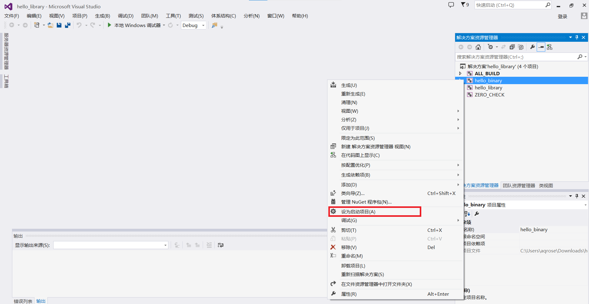

### print hello world
Create an empty folder named "print_hello_world" and then copy files mentioned bellow from this site. Arange them like the following structure:
```
print_hello_world
├── CMakeLists.txt
├── include
│   └── Hello.h
└── src
    ├── Hello.cpp
    └── main.cpp
```

Then open a terminal and run
```
print_hello_world> mkdir build
print_hello_world> cd build
print_hello_world\build> cmake -DCMAKE_BUILD_TYPE=Release "Visual Studio 12 2013 Win64" ..
```
It everything goes well, messages below will appear in you screen
```
-- Building for: Visual Studio 12 2013
-- The C compiler identification is MSVC 18.0.21005.1
-- The CXX compiler identification is MSVC 18.0.21005.1
-- Detecting C compiler ABI info
-- Detecting C compiler ABI info - done
-- Check for working C compiler: D:/vs2013/VC/bin/cl.exe - skipped
-- Detecting C compile features
-- Detecting C compile features - done
-- Detecting CXX compiler ABI info
-- Detecting CXX compiler ABI info - done
-- Check for working CXX compiler: D:/vs2013/VC/bin/cl.exe - skipped
-- Detecting CXX compile features
-- Detecting CXX compile features - done
-- Configuring done
-- Generating done
CMake Warning:
  Manually-specified variables were not used by the project:

    CMAKE_BUILD_TYPE
```
After this, open "print_hello_world\build\hello_binary.vcxproj" via Visual Studio 2013. Just like image below,
<p align="center">
  
</p>
Click "Set as Startup Project" and then "generate", the .exe file can be found at "print_hello_world\build\Debug\hello_binary.exe". Or without opening VS 2013, hello_binary.exe  can also be generated by this command line 

```
print_hello_world\build> cmake --build .
```
